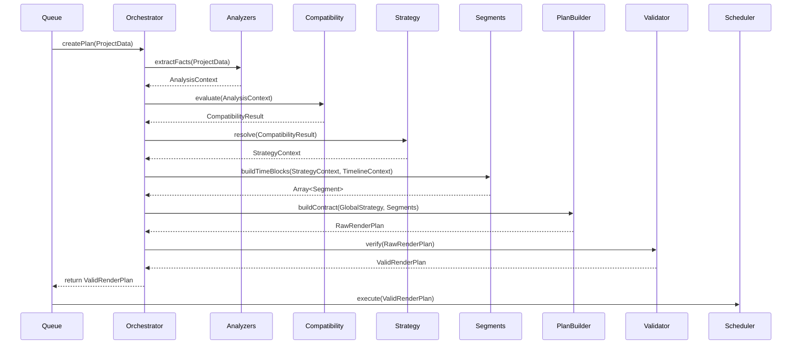

# FAST RENDER ENGINE - PHASE 3: PLANNER INTERNAL ARCHITECTURE
**Project:** M3 Fast Render Engine Master Roadmap
**Status:** DESIGN COMPLETE (NO CODING)

---

## 1. Planner Internal Pipeline
Aliran kerja internal Planner beroperasi layaknya ban berjalan (*assembly line*) pabrik, dengan arah panah tunggal tanpa ada perputaran mundur.

```text
Queue
  ↓ (Project Data)
Planner Orchestrator (Pusat Kendali Eksekusi)
  ↓
1. Analyzers (Mengumpulkan Fakta)
   - Project Analyzer
   - Timeline Analyzer
   - Module Analyzer
   - Hardware Analyzer
  ↓ (Analysis Context)
2. Compatibility Engine (Menilai Kompatibilitas)
  ↓ (Compatibility Result)
3. Strategy Resolver (Memilih Taktik Strategis)
  ↓ (Strategy Result)
4. Segment Builder (Memotong Waktu)
  ↓ (Segmented Tactics)
5. Render Plan Builder (Merakit Kontrak)
  ↓ (Raw Render Plan)
6. Validation Engine (Mengaudit Kontrak)
  ↓
[VALID RENDER PLAN]
```

---

## 2. Responsibility Matrix

| Sub-Engine | Responsibility | Input | Output | Boleh Melakukan | Dilarang Melakukan |
| :--- | :--- | :--- | :--- | :--- | :--- |
| **Analyzers** | Mengekstraksi data riil. | Data Mentah (Proyek) | `AnalysisContext` | Membaca parameter, menghitung jumlah *layer*. | Menentukan mode render, memilih taktik. |
| **Compatibility Engine** | Menilai skor kompatibilitas *Fast Render*. | `AnalysisContext` | `CompatibilityResult` | Mengkalkulasi batasan modul gabungan. | Mengatur *timeline*, membuat blok *segment*. |
| **Strategy Resolver** | Menentukan taktik eksekusi (Bake, Hold, Skip).| `CompatibilityResult` | `StrategyContext` | Memilih algoritma eksekusi FFmpeg & Pipeline. | Memecah waktu (*timeline slicing*). |
| **Segment Builder** | Membangun urutan waktu dan instruksi per detik. | `StrategyContext`, Waktu | `Array<Segment>` | Membuat, menggabungkan, memotong blok waktu. | Mengubah keputusan Strategi Resolusi. |
| **Render Plan Builder** | Membentuk wujud kontrak akhir (*JSON blueprint*). | `Array<Segment>`, Global | `Raw Render Plan` | Menerjemahkan data menjadi format kontrak baku. | Menganalisis ulang, mengubah taktik. |
| **Validation Engine** | Memastikan kontrak tidak memiliki celah fatal. | `Raw Render Plan` | `Valid Render Plan` | Melempar *Error* (Tolak eksekusi jika tidak valid). | Memodifikasi atau merevisi isi Render Plan. |

---

## 3. Data Flow
Data mengalir secara linier (*Unidirectional Data Flow*). Tidak ada komponen yang melompat; misalnya *Segment Builder* tidak boleh langsung membaca Data Mentah Proyek.

`Raw Project` $\rightarrow$ `Analyzers` $\rightarrow$ `Analysis Result` $\rightarrow$ `Compatibility Engine` $\rightarrow$ `Compatibility Level` $\rightarrow$ `Strategy Resolver` $\rightarrow$ `Strategy Matrix` $\rightarrow$ `Segment Builder` $\rightarrow$ `Segments Array` $\rightarrow$ `Render Plan Builder` $\rightarrow$ `Raw Plan` $\rightarrow$ `Validation Engine` $\rightarrow$ `Final Render Plan`.

---

## 4. Planner Context
Objek-objek (DTO - *Data Transfer Objects*) yang bersifat *Immutable* dan saling melengkapi seiring perjalanan:
*   **Project Context:** Data mentah konfigurasi murni dari UI.
*   **Timeline Context:** Daftar titik waktu spesifik (Kapan lagu mulai, kapan lirik A muncul).
*   **Hardware Context:** Spesifikasi RAM & GPU pengguna saat sesi berlangsung.
*   **Analysis Context:** Rangkuman murni (*"Proyek ini memiliki 1 latar, 0 partikel, 50 lirik"*).
*   **Strategy Context:** Cetak biru niat strategis (*"Kita akan menggunakan Layering untuk proyek ini"*).

---

## 5. Analyzer Architecture
Analyzer membedah fakta tanpa menghakimi:
*   **Project Analyzer:** Mengaudit apa yang dirender (Dimensi, Resolusi, Kecepatan Frame).
*   **Timeline Analyzer:** Mengaudit kapan peristiwa terjadi (Durasi, Interval transisi).
*   **Module Analyzer:** Mengaudit siapa saja yang aktif (Particle menyala? Overlay menyala?).
*   **Hardware Analyzer:** Mengaudit tenaga PC saat ini (RAM tersisa, Profil CPU).

---

## 6. Compatibility Engine
Tugas tunggal: Mengambil seluruh `AnalysisContext` dan memadukannya menjadi satu dari 4 label pasti:
`[FULL_FAST]` / `[LAYER_STRATEGY]` / `[EVENT_DRIVEN]` / `[NORMAL_ONLY]`.
Ia tidak tahu bagaimana cara merender *Layer Strategy*, ia hanya mengecap stempel bahwa proyek ini "Hanya Cocok untuk Layer Strategy".

---

## 7. Strategy Resolver
Tugas tunggal: Menerjemahkan stempel *Compatibility* menjadi taktik teknis.
Jika *Compatibility* adalah `[LAYER_STRATEGY]`, *Resolver* akan meracik:
*"Instruksi Latar: Render 1 kali (Bake). Instruksi Lapis Depan: Render tiap frame (Dynamic). Algoritma FFmpeg: Overlay Composition."*

---

## 8. Segment Builder
Tugas tunggal: Manajemen Waktu (Timeline).
*   **Kapan dibuat?** Setelah *Strategy Resolver* selesai memberikan instruksi.
*   **Bagaimana memecah?** Builder melihat `TimelineContext`. Jika ada lirik baru di detik ke-10, ia memotong *Segment 1* (0-10s) dan memulai *Segment 2* (10s-Dst).
*   **Bagaimana digabung?** Jika *Segment 2* dan *Segment 3* kebetulan memiliki kondisi statis yang persis sama, *Builder* akan melakukan *Merge* menjadi satu blok besar agar eksekusi FFmpeg lebih efisien.

---

## 9. Render Plan Builder
Tugas tunggal: *Compiler*.
Mengambil *Global Strategy* dan blok *Segments*, lalu memahatnya menjadi format kontrak JSON kaku (*Render Plan Contract*). Ia dilarang menyisipkan opini atau logika baru.

---

## 10. Validation Engine
Tugas tunggal: Inspektur.
Melakukan pengecekan *Sanity*:
*   **Conflict Detection:** Apakah Layer Latar dan Depan disuruh menempati kanvas yang sama?
*   **Time Continuity:** Apakah total durasi *Segments* persis sama dengan total durasi lagu? (Misal Lagu 10s, tapi Segmen hanya 9s = **REJECT**).
*   Jika tidak valid, *Engine* melempar interupsi sehingga *Fast Render* dibatalkan dan jatuh ke *Normal Render*.

---

## 11. Planner Component Communication
Sistem bersifat **Hierarchical Orchestration**.
Sebuah kelas pusat (`PlannerOrchestrator`) mengendalikan urutan pemanggilan.
*   `StrategyResolver` **TIDAK TAHU** bahwa `CompatibilityEngine` itu ada. Ia hanya menerima nilai.
*   `ValidationEngine` **TIDAK TAHU** siapa yang membuat `Render Plan`. Ia hanya memvalidasi bentuk akhirnya.
*   Hal ini mencegah *Circular Dependency* 100%.

---

## 12. Planner Sequence Diagram



---

## 13. Future Extensibility
Karena Planner dipecah berdasarkan "Fase Eksekusi" (Bukan berdasarkan nama Modul), arsitektur ini mutlak kebal terhadap modul baru (*Generic*).
*   Jika besok ada **3D Module** yang reaktif, *Module Analyzer* lama akan otomatis mencatat keberadaannya, *Compatibility Engine* akan memberikan skor dinamis tinggi, dan *Strategy Resolver* otomatis melemparnya ke lapisan dinamis atau fallback `Normal Only`.
*   Tidak ada satu pun logika inti perencana (*Orchestrator*) yang akan rusak karena *Engine* bertumpu pada abstraksi dan kontrak JSON, bukan pemanggilan kelas modul keras secara langsung.
