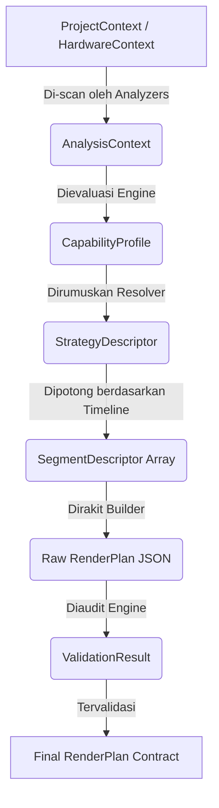

# FAST RENDER ENGINE - PHASE 4: KERNEL & CORE CONTRACTS
**Project:** M3 Fast Render Engine Master Roadmap
**Status:** DESIGN COMPLETE (NO CODING)

---

## 1. Planner Kernel
**Tujuan:** Bertindak sebagai Jantung/Orkestrator utama (State Machine) yang mengoordinasikan seluruh sub-mesin Planner.
**Tanggung Jawab:** Menahan siklus hidup (*lifecycle*), menyebarkan acara (*events*), dan memindahkan Context dari satu mesin ke mesin lain.
**Interaksi:** 
*   **Yang boleh berinteraksi dengannya:** *QueueManager* memanggil Kernel. Kernel memanggil Sub-Engines (Analyzers, Builder).
*   **Yang dilarang:** *RenderScheduler* dilarang tahu keberadaan Kernel (ia hanya menerima hasil). Sub-engines dilarang saling berbicara; mereka hanya berbicara ke Kernel.

---

## 2. Planner Lifecycle
Kernel mengendalikan State Machine yang ketat dan searah (*Unidirectional*):
1.  **INITIALIZED:** Kernel diciptakan, modul-modul mendaftarkan diri.
2.  **ANALYZING:** Kernel memerintahkan seluruh Analyzers.
3.  **COMPATIBILITY_EVALUATION:** Kernel menyerahkan hasil analisa ke *Compatibility Engine*.
4.  **RESOLVING_STRATEGY:** Kernel meminta taktik global dari *Strategy Resolver*.
5.  **SEGMENTING:** Kernel memerintahkan *Segment Builder* untuk memotong waktu.
6.  **BUILDING_PLAN:** Kernel menyuruh *Plan Builder* merakit cetak biru (Blueprint).
7.  **VALIDATING:** Kernel meminta *Validation Engine* mengaudit cetak biru.
8.  **READY / FAILED:** Status akhir (Sukses memberikan Rencana, atau Gagal karena Error).

---

## 3. Planner Events
Kernel digerakkan oleh peristiwa (Event-Driven) untuk menghindari *blocking* tingkat tinggi:
*   `PlanningStarted`
*   `AnalysisCompleted` (Memicu Compatibility Evaluation)
*   `CompatibilityEvaluated` (Memicu Strategy Resolution)
*   `StrategySelected` (Memicu Segmentation)
*   `SegmentsBuilt` (Memicu Plan Building)
*   `RenderPlanCreated` (Memicu Validation)
*   `ValidationPassed` / `ValidationFailed`
*   `PlanningFinished` / `PlanningAborted`

---

## 4. Core Context Contracts
Seluruh data yang mengalir berbentuk DTO (*Data Transfer Object*) statis / *Immutable*:
*   **ProjectContext:** *(Dibuat oleh Kernel)* Berisi ID Proyek, FPS, Resolusi, daftar aset mentah.
*   **TimelineContext:** *(Dibuat oleh Analyzer)* Berisi BPM, durasi mutlak, penanda waktu lirik (Cues).
*   **HardwareContext:** *(Dibuat oleh Analyzer)* Berisi kapasitas RAM VRAM, profil CPU.
*   **AnalysisContext:** Kumpulan dari Project, Timeline, Hardware, dan fakta modul.
*   **CompatibilityContext:** *(Dibuat oleh CompatibilityEngine)* Menyimpan Profil Kemampuan gabungan proyek.
*   **StrategyContext:** *(Dibuat oleh StrategyResolver)* Menyimpan niat taktis.
*   **SegmentContext:** *(Dibuat oleh SegmentBuilder)* Array dari potongan waktu riil.
*   **ValidationContext:** Laporan jejak audit.

---

## 5. Capability Profile
Planner tidak lagi mendeteksi nama "Lirik" atau "Particle". Ia hanya membaca *Capability Profile* (Kemampuan Abstrak) yang dihasilkan modul:
*   `SupportsStaticBaking` (Cocok untuk lapisan bawah yang mati / *Hold Frame*).
*   `SupportsLayerComposition` (Cocok untuk dirender di lapisan atas transparan).
*   `SupportsFrameDuplication` (Toleran terhadap pengulangan frame tanpa artefak).
*   `RequiresRealtimeSampling` (Memaksa mesin dirender dari 0 jika ada lompatan waktu).
*   `RequiresContinuousTimeline` (Menolak *Fast-Forward*).

Jika sebuah modul mengibarkan bendera `RequiresContinuousTimeline`, Compatibility Engine otomatis menjatuhkan status ke `Normal Only`.

---

## 6. Strategy Descriptor
Deskriptor ini hanya berisi deklarasi niat, bukan kode implementasi:
*   **StrategyType:** `STATIC_BAKE` | `LAYERED_DYNAMIC` | `EVENT_DRIVEN_DUPLICATION` | `LEGACY_FALLBACK`.
*   **LayeringIntent:** Memisahkan kanvas menjadi `[BaseLayer, DynamicLayer, TopLayer]`.
*   **OptimizationGoal:** `MINIMIZE_DRAW_CALLS` | `MINIMIZE_FS_IO` | `MAINTAIN_60FPS`.

---

## 7. Segment Descriptor
Bentuk representasi satu blok waktu:
*   `startMs` / `endMs`: Waktu mulai dan akhir absolut (Milidetik).
*   `triggerEvent`: Peristiwa apa yang melahirkan segmen ini (misal: "Lirik Masuk").
*   `strategy`: `Bake` / `Skip` / `Render`.
*   `activeLayers`: Array mesin apa saja yang harus berputar di segmen ini.
*   `dependencies`: Apakah segmen ini butuh *cache* dari segmen sebelumnya?

---

## 8. Render Plan Contract
Kontrak pamungkas (JSON) yang ditandatangani oleh Planner dan diserahkan ke *Scheduler*.
*   **Mandatory Field:** `version` (misal "1.0.0"), `projectId`, `globalStrategy`, `totalDurationMs`, array `segments`.
*   **Optional Field:** `metadata` (untuk *debugging*), `hardwareProfile`.
*   **Validation Rules:** Wajib ditolak jika `totalDurationMs` tidak sama persis dengan total penjumlahan ujung awal dan akhir di seluruh `segments`.
*   **Extensibility:** Memiliki blok `customProperties` khusus jika ada mesin baru yang butuh injeksi data *render* spesifik.

---

## 9. Validation Result Contract
Validation Engine tidak boleh memodifikasi *Plan*. Ia hanya menerbitkan laporan:
*   **Status:** `SUCCESS` | `WARNING` | `RECOVERABLE_ERROR` | `FATAL_ERROR`.
*   **Messages:** Array teks (*"Segment 2 overlaps with Segment 3"*, *"Particle Engine forced into Static Layer"*).
*   Jika `WARNING`, *Scheduler* boleh tetap mengeksekusi. Jika `ERROR`, Planner akan membatalkan *Fast Render*.

---

## 10. Planner Error Model
Standar Error yang tegas untuk *Fail-Fast Mechanism*:
*   `InvalidTimelineError`: Durasi lagu tidak valid / negatif.
*   `UnsupportedCapabilityError`: Ada modul bentrok yang tidak bisa di-*Bake*.
*   `StrategyConflictError`: Algoritma strategi berbenturan (misal: Disuruh *Skip* tapi Layering mensyaratkan *Render*).
*   `SegmentOverlapError`: Dua segmen memiliki irisan rentang waktu yang sama.
*   `ValidationFailureError`: Diblokir oleh Inspektur.

---

## 11. Planner Extension Contract
Agar modul masa depan (Misal: Modul 3D) otomatis didukung oleh Planner:
Modul wajib menyediakan fungsi (Kontrak) statis bertajuk `getCapabilityDescriptor()`.
Planner saat tahap *Ingestion* akan memanggil fungsi tersebut, membaca profilnya (misal: Modul 3D menyatakan `RequiresContinuousTimeline: true`), lalu Planner otomatis menyesuaikan taktik ke `Normal Only` secara sendirinya, tanpa perlu diajari.

---

## 12. Planner Public API
API konseptual (Wajah Luar Planner):
*   `createPlan(project, hardwareInfo): RenderPlan` -> Membangun rencana penuh.
*   `validatePlan(renderPlan): ValidationResult` -> Memeriksa rencana secara independen.
*   `explainDecision(renderPlan): string` -> Menerjemahkan JSON ke dalam teks bahasa manusia mengapa taktik A dipilih (Sangat berguna untuk Debugging).
*   `estimateStrategy(project): CapabilityProfile` -> Mode "Cepat" sekadar untuk mengecek kompatibilitas tanpa harus memotong segmen waktu.

---

## 13. Sequence of Core Contracts

