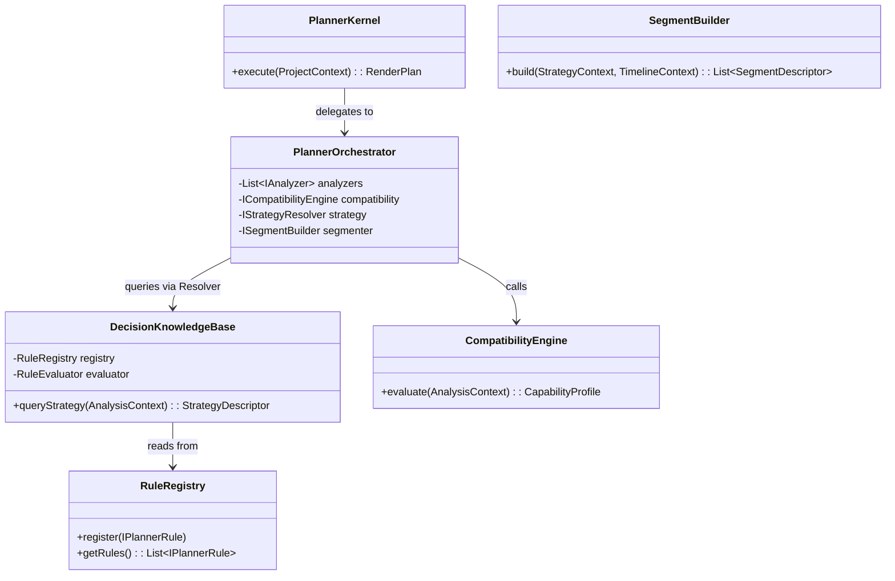

# FAST RENDER ENGINE - PHASE 6: CLASS & INTERFACE DESIGN
**Project:** M3 Fast Render Engine Master Roadmap
**Status:** DESIGN COMPLETE (NO CODING)

---

## 1. Planner Package Structure
Struktur direktori dirancang untuk mengunci isolasi tanggung jawab (Separation of Concerns). Semua paket berada di dalam `src/services/pipeline/fastrender/`:

*   `core/` $\rightarrow$ Menyimpan `PlannerKernel` dan `PlannerOrchestrator`. Titik masuk utama.
*   `contracts/` $\rightarrow$ Menyimpan seluruh DTO (*Data Transfer Objects*) dan Model Konteks. Paket terbodoh (Tidak boleh ada fungsi logika).
*   `interfaces/` $\rightarrow$ Menyimpan definisi kontrak abstrak (e.g. `IAnalyzer`).
*   `analyzers/` $\rightarrow$ Implementasi pengumpul fakta (`ProjectAnalyzer`, `HardwareAnalyzer`).
*   `engines/` $\rightarrow$ Mesin pemroses linier (`CompatibilityEngine`, `StrategyResolver`, `SegmentBuilder`, `ValidationEngine`).
*   `knowledge/` $\rightarrow$ Tempat bersemayamnya `DecisionKnowledgeBase`, `RuleEvaluator`, dan pendefinisian `Rules`.
*   `registry/` $\rightarrow$ Penyimpan daftar dinamis (`RuleRegistry`, `AnalyzerRegistry`).
*   `factories/` $\rightarrow$ Pabrik perakit ketergantungan (`PlannerFactory`).
*   `exceptions/` $\rightarrow$ Pohon hirarki *Error* khusus Planner.

---

## 2. Complete Class Diagram
Diagram hubungan antar kelas utama menggunakan prinsip Inversi Kendali (IoC):



---

## 3. Interface Design
Memaksa batasan perilaku tanpa membocorkan detail implementasi:

*   `IAnalyzer`:
    *   `analyze(ProjectContext): AnalysisContext`
*   `IPlannerRule`:
    *   `getIdentifier(): String`
    *   `getPriority(): Number`
    *   `evaluate(CapabilityProfile): RuleResult`
*   `ICompatibilityEngine`:
    *   `evaluate(AnalysisContext): CapabilityProfile`
*   `IStrategyResolver`:
    *   `resolve(CapabilityProfile, DecisionKnowledgeBase): StrategyContext`
*   `ISegmentBuilder`:
    *   `buildTimeBlocks(StrategyContext, TimelineContext): List<SegmentDescriptor>`
*   `IRenderPlanBuilder`:
    *   `buildContract(StrategyContext, List<SegmentDescriptor>): RenderPlan`
*   `IValidationEngine`:
    *   `verify(RenderPlan): ValidationResult`

---

## 4. DTO Design (Data Transfer Objects)
Semua kelas ini murni menampung *properties*. Dilarang memiliki *methods* bervolume (Kecuali *getter/setter* murni atau `freeze`).
*   **ProjectContext**: `{ projectId, resolution, fps, assets[] }`
*   **TimelineContext**: `{ durationMs, cues[] }`
*   **AnalysisContext**: `{ project: ProjectContext, hardware: HardwareContext, timeline: TimelineContext }`
*   **CapabilityProfile**: `{ supportsBaking: boolean, requiresRealtime: boolean }`
*   **StrategyDescriptor**: `{ globalStrategy: Enum, optimizeDrawCalls: boolean }`
*   **SegmentDescriptor**: `{ startMs: number, endMs: number, strategy: Enum, activeLayers: string[] }`
*   **RenderPlan**: `{ version: string, globalStrategy: Enum, segments: SegmentDescriptor[] }`
*   **ValidationResult**: `{ isValid: boolean, status: Enum, warnings: string[], errors: string[] }`

---

## 5. Registry Design
*   **RuleRegistry**:
    *   *Lifecycle:* *Singleton* pada tingkatan aplikasi (Mati ketika *browser* di-*refresh*). Didaftarkan satu kali saat M3 melakukan inisialisasi awal (*Bootstrap*).
*   **AnalyzerRegistry**:
    *   *Lifecycle:* Diciptakan saat *PlannerFactory* merakit mesin. Berisi susunan statis dari 4 Analyzer dasar, tapi terbuka jika *plugin* menambahkan Analyzer baru.

---

## 6. Factory Design
*   **PlannerFactory**:
    Bertanggung jawab merakit seluruh mesin (*Dependency Injection* secara manual jika tidak pakai pustaka DI). 
    *Fungsi:* `createPlanner(): PlannerKernel`. Di dalamnya ia akan menyuntikkan *CompatibilityEngine*, *StrategyResolver*, dan mendaftarkan kelas abstrak ke `PlannerOrchestrator`.
*   **ContextFactory**:
    Membantu merakit DTO mentah dari format JSON lama M3 menjadi `ProjectContext` yang kaku.

---

## 7. Exception Hierarchy
Struktur *Fast-Fail* untuk memutus operasi ilegal:

```text
PlannerException (Extends Error)
 ├── ValidationException (Jika kontrak gagal audit)
 ├── StrategyException (Jika resolver gagal menemukan taktik)
 ├── KnowledgeBaseException (Jika ada aturan duplikat/invalid)
 ├── SegmentException (Jika ada irisan waktu tumpang tindih)
 └── CompatibilityException (Jika hardware tidak diizinkan Fast Render)
```
*Penggunaan:* Digunakan murni di dalam wilayah paket `fastrender/`. Modul di luarnya cukup menangkap (*catch*) `PlannerException` secara generik.

---

## 8. Dependency Rules (Aturan Rantai Ketergantungan)
Untuk mencegah *Spaghetti Code* (Ketergantungan melingkar):
1.  **Paket `contracts/` dan `interfaces/`** tidak boleh mengimpor (*import*) file apapun dari paket lain. Mereka adalah Dasar Piramida.
2.  **Paket `engines/`** HANYA boleh mengimpor dari `interfaces/` dan `contracts/`.
3.  **Paket `core/` (Orchestrator)** boleh mengimpor semua Antarmuka (Interface), tetapi **dilarang keras** mengimpor implementasi konkret secara langsung (Harus disuntik via Factory).
4.  **Paket `knowledge/`** murni terisolasi, hanya bergantung pada *Contracts*.

---

## 9. Sequence Mapping
Jalur eksekusi konkret OOP:
*   `PlannerKernel.execute()` memanggil `ICompatibilityEngine.evaluate()`.
*   Objek mentah dilebur menjadi `AnalysisContext` (DTO).
*   `StrategyResolver` (Class) memanggil `DecisionKnowledgeBase.queryStrategy()`.
*   DKB me-loop daftar `IPlannerRule` dari `RuleRegistry`.
*   Terpilih `StrategyDescriptor` (Contract).
*   Diserahkan ke `SegmentBuilder` (Class) lalu ke `RenderPlanBuilder` (Class).
*   Keluaran akhirnya adalah objek kaku `RenderPlan`.

---

## 10. Implementation Readiness Review

*   **Apakah seluruh class sudah memiliki tanggung jawab tunggal?** 
    **YA.** Tidak ada kelas yang melakukan Analisis sekaligus Pemotongan Waktu. Semua dikotak-kotak via Antarmuka.
*   **Apakah seluruh dependency aman?** 
    **YA.** Dengan aturan impor hirarkis dari Dasar Piramida (Contracts) ke Puncak (Core), *Circular Dependency* mustahil terjadi.
*   **Apakah seluruh kontrak telah dipetakan?** 
    **YA.** DTO, Interface, Factory, dan Registry telah mencakup seluruh kebutuhan aliran data dari Phase 1 hingga 5.
*   **Apakah implementasi dapat dimulai tanpa perubahan arsitektur?** 
    **YA.** Arsitektur ini sudah mencapai tahap *Concrete Abstraction*. Kelas kosong (Skeleton) sudah siap diketik pada *Phase* selanjutnya.

*(Catatan Pematangan: Tidak ada area yang tertinggal. Desain cetak biru OOP telah sempurna mengunci Master Roadmap M3 Fast Render.)*
