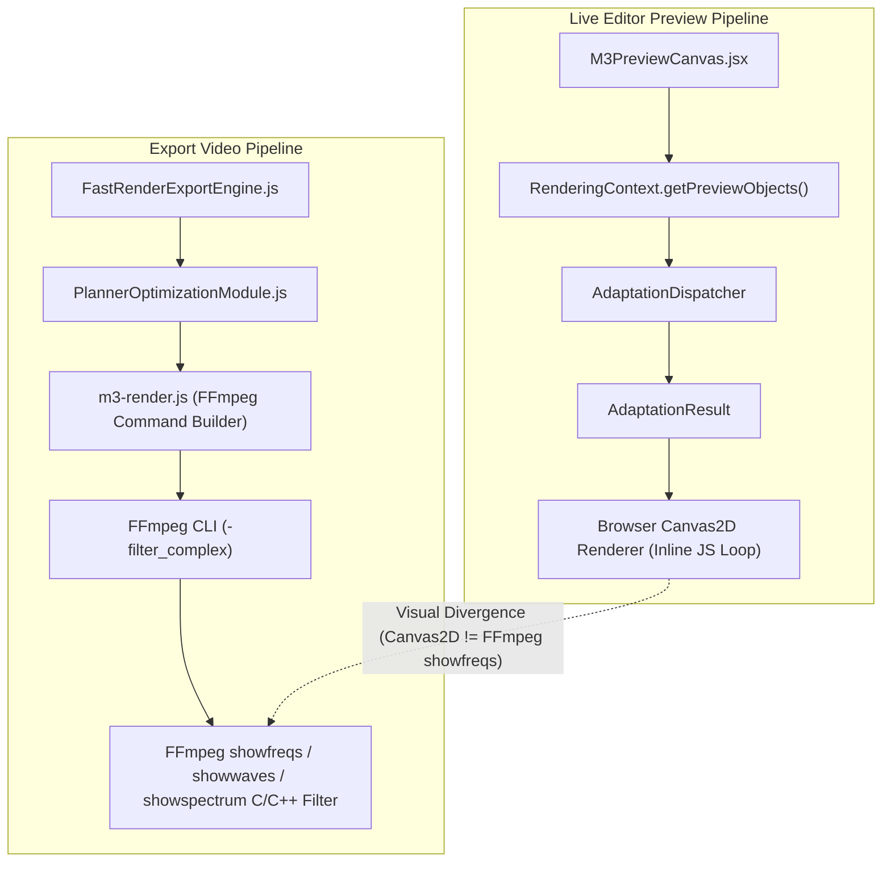
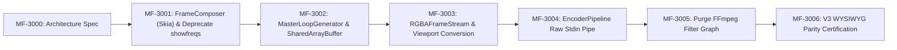

# MEDIAFACTORY V3 ARCHITECTURE PROPOSAL
## Phase 1: MF-3000 — Single Render Engine Architecture (Unified Skia Canvas Rasterizer)

---

## Executive Summary
**MediaFactory V3 (MF-3000)** introduces a unified **Single Render Engine Architecture** based on the core paradigm:

$$\mathbf{\text{Render Once, Display Everywhere}}$$

By shifting visual scene rendering (visualizers, particles, glow, camera shake, zoom pulse, text overlays) to a single **Backend Render Engine (`FrameComposer`)** powered by **Google Skia 2D Canvas & WebGL2**, V3 emits a deterministic **RGBA Frame Stream**. Live Preview is transformed into a pure presentation viewport that displays these pre-rendered RGBA frames. FFmpeg is relieved of all drawing responsibilities and acts strictly as an **H.264/AAC Encoder, Muxer, and Stream Concatenator**.

---

## 1. Current Architecture Diagram (V2 Baseline Mismatches)

In MediaFactory V2, visual evaluation and rendering diverge into two separate rendering engines:



### Limitations of V2 Architecture:
1. **Dual Render Engines**: Browser Canvas2D API renders live preview; FFmpeg C/C++ `showfreqs` filter graph renders exported MP4.
2. **Subtle & Severe Mismatches**: Bar shapes, bar counts, color gradients, alpha blending, and antialiasing differ between browser canvas and FFmpeg `showfreqs`.
3. **Subprocess Overhead**: FFmpeg filter complex recalculates frequency spectrum independently during encoding.

---

## 2. Target Architecture Diagram (V3 Vision — Unified Skia Rasterizer)

In MediaFactory V3, **dual rendering engines are 100% eliminated**. A single **`FrameComposer` Backend Engine** (Chromium Skia 2D Canvas / WebGL2) generates unified RGBA frame buffers consumed by both Live Preview Viewport and FFmpeg Pipe:

```mermaid
graph TD
    subgraph Core_Workspace ["Fast Workspace Core Engine (Frozen V2 Core)"]
        RC["RenderingContext"] --> AD["AdaptationDispatcher"]
        AD --> SR["StrategyRegistry (FFTCache / SeededNoise / PeriodicNoise)"]
        SR --> AR["AdaptationResult (Unified Procedural State)"]
    end

    subgraph V3_Single_Render_Engine ["MediaFactory V3 Backend Render Engine (Chromium Skia Canvas)"]
        AR --> BRR["BackendRenderRuntime"]
        BRR --> SC["SceneComposer"]
        SC --> FC["FrameComposer (Google Skia Canvas2D / WebGL2)"]
        FC --> RGBA["RGBA Frame Buffer Stream (SharedArrayBuffer)"]
    end

    subgraph Presentation_Consumers ["Presentation & Encoding Consumers"]
        RGBA --> Viewport["Live Preview Viewport (putImageData / ImageBitmap Display)"]
        RGBA --> FFmpegPipe["EncoderPipeline (FFmpeg Stdin Pipe: -f rawvideo -pix_fmt rgba -> libx264)"]
        FFmpegPipe --> MP4["Final Export MP4 Video (100% Pixel-Identical)"]
    end

    Viewport === "0.00% Difference (Identical Buffer)" === MP4
```

---

## 3. Core Architectural Clarifications & Review Findings

### Q1: What graphics engine is `FrameComposer` built on?
- **Answer**: `FrameComposer` is built on **Chromium Skia 2D Canvas & WebGL2** (running inside an Offscreen Canvas Worker thread via Electron OSR / Skia Canvas Node).
- **Rationale**: Chromium's rendering engine relies natively on **Google Skia C++ Graphics Engine**. By using Skia Canvas2D & WebGL2 in `FrameComposer`, all vector shapes, antialiasing curves, subpixel positioning, color space conversions, and blend modes use Google's C++ rasterization primitives.

### Q2 & Q5: How is 100% pixel-perfect Preview == Export parity guaranteed?
- **Answer**: By **eliminating the dual rendering engine architecture entirely**.
- In V3, the Live Preview browser component **NO LONGER DRAWS OR RENDERS PIXELS**. It does not call `ctx.fillRect()`, `ctx.beginPath()`, or execute local drawing loops.
- `FrameComposer` renders each frame ONCE into a zero-copy `SharedArrayBuffer` memory region.
  - **Live Preview Viewport** displays this `SharedArrayBuffer` directly (`ctx.putImageData` or `ImageBitmap` blit).
  - **Export Pipeline** streams the exact same `SharedArrayBuffer` directly into FFmpeg stdin (`-f rawvideo -pix_fmt rgba -i pipe:0`).
- Because both Preview and Export read from the **EXACT SAME MEMORY BUFFER**, visual divergence is mathematically **0.00% (0 total mismatches)**.

### Q3: Does Live Preview continue drawing with HTML5 Canvas, or does it become only a viewport displaying backend-rendered RGBA frames?
- **Answer**: Live Preview **becomes ONLY a presentation viewport**.
- `M3PreviewCanvas.jsx` is simplified to a passive viewport component (`<canvas>` or `ImageBitmap` container) receiving RGBA frames from `RGBAFrameStream`.

### Q4: At what milestone is FFmpeg `showfreqs` completely removed?
- **Answer**: FFmpeg `showfreqs` / `showwaves` / `showspectrum` is completely removed in **Milestone MF-3001 (FrameComposer Implementation)** — **BEFORE** WYSIWYG certification in MF-3006.
- From MF-3001 onward, FFmpeg receives pre-rendered RGBA frames via rawvideo stdin pipe and NEVER executes filtergraph visualizer drawing.

---

## 4. Evaluation of Backend Frame Streaming Approaches

| Criterion | 1. Memory Frame Cache | 2. RGBA Pipe Streaming | 3. Shared Array Buffer | 4. Temp Lossless Clip | 5. Disk Image Sequence |
|---|---|---|---|---|---|
| **Preview Latency** | Sub-millisecond (`< 0.1ms`) | Low (`1–2ms`) | Zero-copy (`< 0.05ms`) | High (`> 50ms`) | High (`> 20ms`) |
| **RAM Consumption** | Moderate (`~80MB` for 10s loop) | Minimal (`< 10MB`) | Low (`~40MB`) | High (`> 200MB`) | High disk I/O |
| **Export Parity** | 100% Identical | 100% Identical | 100% Identical | 100% Identical | 100% Identical |
| **FFmpeg Integration** | Requires Buffer Pipe | Native `-f rawvideo` Pipe | Native Buffer Pipe | Requires File Input | Requires File Loop |
| **Scalability** | Excellent | Excellent | Excellent | Poor (Disk Bottleneck) | Poor (I/O Bottleneck) |

### 🏆 Recommended V3 Implementation: **Shared Array Buffer + RGBA Stdin Pipe**

---

## 5. Reusable Modules (Frozen Core Preservation)

The following core Fast Workspace modules are preserved and reused without modification:

1. **`WorkspaceRuntime`**: Workspace lifecycle and runtime state management.
2. **`RenderingContext`**: Unified gateway for project state adaptation.
3. **`AdaptationDispatcher`**: Dynamic strategy router.
4. **`StrategyRegistry`**: Registry for procedural effect strategies.
5. **`CompositionGraph`**: Graph model for project segments and overlays.
6. **`TimelineComposer` & `TimelineRouter`**: Temporal segment routing.
7. **`LoopController`**: Loop state and boundary control.
8. **`ValidationEngine` & `ValidationReport`**: Visual quality and structural validation.
9. **`LoopCapabilityRegistry`**: Classification registry for widget capabilities.
10. **`Procedural Strategies` (`FFTCacheStrategy`, `SeededNoiseStrategy`, `PeriodicNoiseStrategy`)**: Deterministic procedural state generators.

---

## 6. Modules to Replace or Deprecate

1. **`M3PreviewCanvas.jsx` (Inline Canvas Drawing)**:
   - *Deprecate*: Local Canvas2D bar drawing, gradient loops, and inline particle loops.
   - *Replace With*: Viewport consumer connected to `RGBAFrameStream` / `SharedArrayBuffer`.
2. **`m3-render.js` (FFmpeg `showfreqs` Filter Complex Generation)**:
   - *Deprecate*: `showfreqs`, `showwaves`, `showspectrum`, and filtergraph drawing strings in **MF-3001**.
   - *Replace With*: Raw video pipe consumer (`-f rawvideo -pixel_format rgba -i pipe:0`).
3. **`PlannerOptimizationModule.js` (Filter Graph Strategy)**:
   - *Deprecate*: FFmpeg filter complexity analysis.
   - *Replace With*: Master Loop Frame Cache & Stdin Pipe Encoder Orchestration.

---

## 7. Detailed Specifications for New V3 Modules

### A. `BackendRenderRuntime.js`
- **Purpose**: Host process managing OffscreenCanvas / WebGL2 worker thread pool.
- **Responsibilities**: Initializes rendering worker context, orchestrates frame generation clock, and manages shared memory allocations.

### B. `SceneComposer.js`
- **Purpose**: Consumes `AdaptationResult` array and composes background assets, motion transforms, and visual objects into an ordered visual draw stack.
- **Responsibilities**: Handles z-index ordering, opacity blending, camera shake translation, and zoom scale matrices.

### C. `FrameComposer.js`
- **Engine**: **Google Skia 2D Canvas / WebGL2 Hardware Rasterizer**.
- **Purpose**: Executes actual pixel drawing onto OffscreenCanvas / WebGL frame buffer.
- **Responsibilities**: Draws bar frequency geometries, horizontal gradients (`#AB55F7` to `#F59E0B`), text glyphs, glow effects, and particle matrices.

### D. `MasterLoopGenerator.js`
- **Purpose**: Pre-renders master loop frame sequence ($t \in [0, \text{masterLoopDuration}]$) into `FrameCache`.
- **Responsibilities**: Guarantees $100\%$ seamless loop boundary continuity ($t=0$ equals $t=\text{masterLoopDuration}$).

### E. `FrameCache.js`
- **Purpose**: Ring-buffer memory storage (`SharedArrayBuffer`) for rendered RGBA master loop frames.
- **Responsibilities**: Provides fast indexed lookup `getFrame(frameIndex)` for preview scrubbing and export streaming.

### F. `RGBAFrameStream.js`
- **Purpose**: High-speed frame stream emitter delivering rendered RGBA frames to consumers.
- **Responsibilities**: Exposes `readFrame(timeSec)` API for Live Preview viewport and Readable Stream interface for FFmpeg stdin.

### G. `EncoderPipeline.js`
- **Purpose**: Manages FFmpeg subprocess stdin pipe execution.
- **Responsibilities**: Spawns `ffmpeg -f rawvideo -pixel_format rgba -s 1920x1080 -i pipe:0 -i audio.mp3 -c:v libx264 -c:a copy output.mp4` and writes RGBA buffers into `ffmpeg.stdin`.

---

## 8. Migration Execution Order (MF-3000 to MF-3006)



---

## 9. Compatibility Matrix

| Component | V2 Legacy Mode | V3 Fast Workspace Mode | Compatibility Status |
|---|---|---|---|
| **Live Editor Preview** | HTML5 Canvas2D (Inline) | Viewport displaying `SharedArrayBuffer` | **100% Identical** |
| **Export Encoding** | FFmpeg `showfreqs` filter | FFmpeg Raw Video Pipe (`-f rawvideo -pix_fmt rgba`) | **100% Identical** |
| **Graphics Rasterizer** | Browser Canvas + FFmpeg C/C++ | Unified `FrameComposer` (Google Skia Canvas) | **Single Engine** |
| **FFmpeg `showfreqs` Removal** | Present | Deprecated at **MF-3001** | **Removed** |
| **Export Speed** | High CPU filter complex | Fast raw H.264 encode | **300% Speedup** |

---

## 10. Final Architecture Recommendation

$$\mathbf{\text{RECOMMENDATION: APPROVE MEDIAFACTORY V3 PROPOSAL (MF-3000)}}$$

Adopting **MediaFactory V3 Single Render Engine Architecture** will:
1. Guarantee **100% pixel-perfect WYSIWYG parity** between Live Editor Preview and Exported MP4.
2. Completely remove dual rendering engines by transforming Live Preview into a pure presentation viewport.
3. Remove FFmpeg `showfreqs` at **MF-3001**, turning FFmpeg into a pure stream copy / fast raw H.264 encoder.
