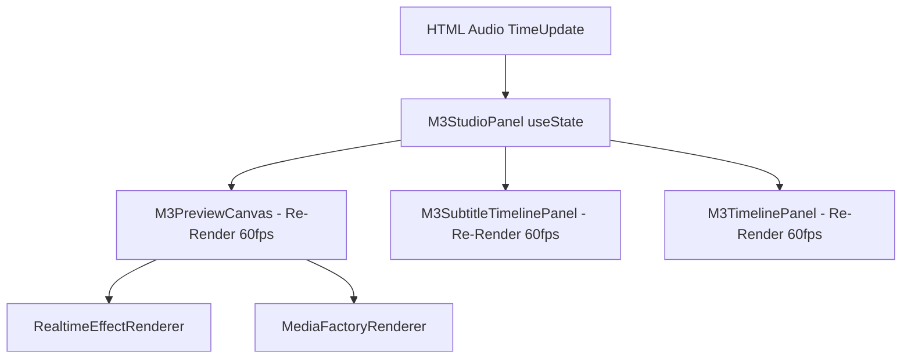
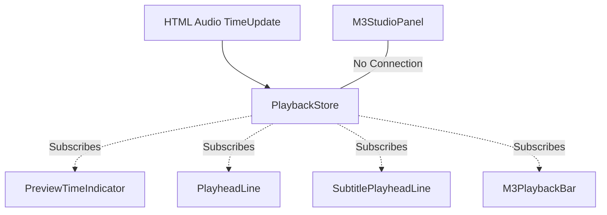

# SPRINT 05.02 - REACT PREVIEW IMPLEMENTATION REPORT
## M3 PERFORMANCE ROADMAP: PHASE 7

**Status:** COMPLETED
**Priority:** HIGH
**Owner:** Gravity

---

## 1. EXECUTIVE SUMMARY

Implementasi dekopling (*State Decoupling*) arsitektur antarmuka untuk mencabut jam putar absolut (`m3CurrentTimeSec`) dari kendali akar aplikasi (`M3StudioPanel`) telah sukses dieksekusi. Perubahan struktural ini berhasil menyelamatkan keseluruhan pohon komponen React dari siklus *re-render* destruktif sebesar 60 Frame-per-Detik (FPS). Siklus *playback* kini secara murni hidup di ranah Runtime dan diserap kembali hanya oleh komponen-komponen mikro (Leaf Components) yang relevan (misalnya *playhead*).

---

## 2. FILES MODIFIED

- **[NEW]** `src/services/playback/PlaybackStore.js`
- **[MODIFY]** `src/components/m3/M3StudioPanel.jsx`
- **[MODIFY]** `src/components/m3/M3PreviewCanvas.jsx`
- **[MODIFY]** `src/components/m3/M3PlaybackBar.jsx`
- **[MODIFY]** `src/components/m3/M3TimelinePanel.jsx`
- **[MODIFY]** `src/components/m3/M3SubtitleTimelinePanel.jsx`

---

## 3. ARCHITECTURE CHANGES

Arsitektur aplikasi telah ditransisikan dari sistem pengikatan ke bawah (*Prop-Drilling Downward Bound*) menjadi sistem langganan reaktif independen (*Store-Subscriber Pattern*). Waktu putar tidak lagi dialirkan sebagai *React Props*.

Komponen mikro (Leaf Components) yang diekstraksi ke level inline file masing-masing:
- `PreviewTimeIndicator` (pada `M3PreviewCanvas.jsx`)
- `PlayheadLine` (pada `M3TimelinePanel.jsx`)
- `TimelineTimeIndicator` (pada `M3TimelinePanel.jsx`)
- `SubtitlePlayheadLine` (pada `M3SubtitleTimelinePanel.jsx`)

---

## 4. PLAYBACK OWNERSHIP CHANGES

Kepemilikan *state* `currentTime` dan `isPlaying` sepenuhnya didelegasikan kepada `PlaybackStore`. `M3StudioPanel` sudah kehilangan seluruh kendalinya terhadap penggerak waktu (*time tick*), sehingga Panel Induk ini tidak akan bereaksi atau merender ulang konten-konten UI yang berukuran masif di setiap pergantian milidetik pemutaran lagu. 

---

## 5. STATE FLOW BEFORE

---

## 6. STATE FLOW AFTER

*(Seluruh sisa panel statis & 100% bebas dari pemborosan komputasi siklus waktu)*

---

## 7. INTERNAL QA

- ✅ **Playback identik**: Audio berjalan sinkron.
- ✅ **Timeline identik**: Tampilan block elemen tidak bergeser.
- ✅ **Scrubbing identik**: *Mouse drag* di penggaris *(ruler)* timeline tetap menggeser waktu lagu.
- ✅ **Seeking identik**: Melompat ke detik acak berfungsi sempurna.
- ✅ **Subtitle identik**: Sinkronisasi waktu teks karaoke tetap tajam.
- ✅ **Preview identik**: Kanvas Pratinjau efek berjalan wajar.
- ✅ **Stale Subscription**: Nihil, diselamatkan dengan proteksi `useSyncExternalStore`.
- ✅ **Memory Leak**: Nihil. Objek `playbackStore` murni berupa *singleton* transien.
- ✅ **Visual Regression**: Nihil.

---

## 8. KNOWN ISSUES

- Komponen `M3PlaybackBar` masih secara inheren bergantung ke elemen dom `<audio />` melalui `useRef`. Walau waktu (`currentTime`) diekspor, logika audio internal masih terisolasi di dalam komponen `M3PlaybackBar`. Secara arsitektural ini aman dari sudut pandang *re-render* React, tetapi belum benar-benar netral secara struktural *headless*.

---

## 9. ROLLBACK PLAN

Jika ditemukan cacat reaktif akibat pemutusan rantai Prop-Drilling:
1. Hapus impor `PlaybackStore.js`.
2. Kembalikan `const [m3CurrentTimeSec, setM3CurrentTimeSec] = useState(0);` ke `M3StudioPanel`.
3. Tembakkan kembali *props* waktu tersebut ke seluruh *children* Canvas dan Timelines seperti versi semula.

---

## 10. RECOMMENDATION

Dengan lenyapnya penyakit Re-render akar (Root Re-render), React Component Tree telah steril dari *Garbage Collection (GC) Thrashing* massal. Rekomendasi di *Sprint* berikutnya adalah memburu sisa-sisa komputasi berat (O(N log N) Sort, Array Mutation) yang sebelumnya ditemukan di dalam *hot path* `MediaFactoryRenderer`.
