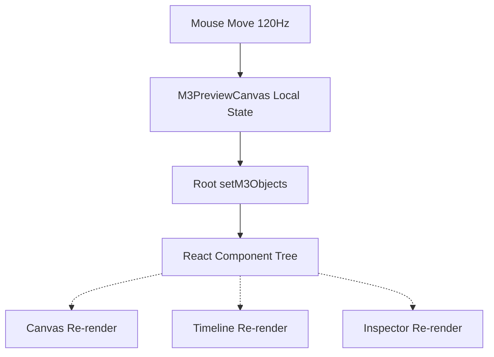
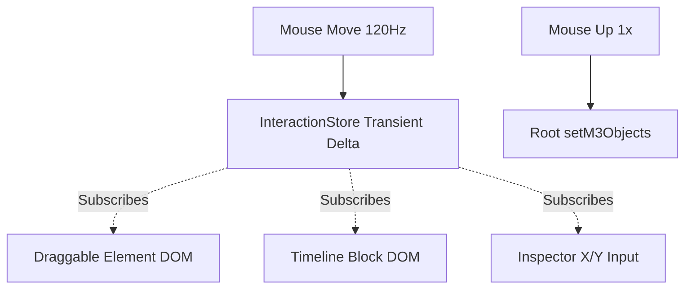

# SPRINT 06.01 - INTERACTION RUNTIME ARCHITECTURE VALIDATION
## M3 PERFORMANCE ROADMAP: PHASE 8

**Status:** COMPLETED
**Priority:** CRITICAL
**Owner:** Gravity

---

## 1. EXECUTIVE SUMMARY

Sprint ini mengevaluasi aliran data (lifecycle) interaksi pengguna di atas kanvas dan komponen *timeline*. Hasil forensik membuktikan bahwa menyatukan status sementara pergeseran kursor (*Transient State*) ke dalam status akar proyek (*Global Project State*) adalah anti-pattern fatal. Interaksi yang terjadi di frekuensi $\sim$120 Hz harus dijembatani dengan *Interaction Runtime* terisolasi sebelum di-*commit* secara resmi ke *Global State*.

---

## 2. LIFECYCLE MAPPING & STATE OWNERSHIP

| Event / Phase | Current Architecture | Proposed Architecture |
| :--- | :--- | :--- |
| **Pointer Down** | Menyimpan `startX, startY` di state lokal kanvas. | Menyimpan data awal di `InteractionStore` (External Store). |
| **Selection** | Global `setM3SelectedObjectId`. Merender ulang seluruh UI. | Menyimpan ID di `InteractionStore` (jika multipel). |
| **Drag Start** | Mengaktifkan flag `isDragging` lokal. | Mengubah status `isDragging` di `InteractionStore`. |
| **Pointer Move** | Eksekusi `setM3Objects` (Global State) memicu 100+ re-render akar. | Eksekusi `InteractionStore.setState({ deltaX, deltaY })`. |
| **Visual Update** | Seluruh UI, Timeline, Inspector, Kanvas dirender ulang total. | *Leaf Components* (DOM Node elemen) membaca koordinat dari *store* dan memperbarui CSS transform murni, memotong React Commit konvensional. |
| **Pointer Up** | Mematikan `isDragging`. Emit event `Canvas.ObjectMoved`. | **[COMMIT PHASE]** Menghitung koordinat final, tembak ke `setM3Objects`. |
| **Undo / Redo** | Berisiko menangkap pecahan frame apabila debounce gagal. | Sempurna. Hanya menangkap 1 *snapshot* bersih pada saat kursor dilepas. |

---

## 3. ARCHITECTURE VALIDATION (Q&A)

1. **Apakah posisi object saat drag harus menjadi Global State?**
   **TIDAK.** Selama mouse ditekan dan bergerak, posisi itu berstatus sementara (*Transient*).
   
2. **Apakah cukup Runtime State?**
   **CUKUP.** Kita membutuhkan ekosistem *InteractionStore* (mirip *PlaybackStore*) yang menampung *delta* pergerakan tanpa menyentuh *React Root Component*.
   
3. **Kapan commit dilakukan?**
   Murni hanya pada tahapan **Pointer Up** (saat klik mouse dilepaskan). Barulah koordinat akhir ditimpa ke `m3Objects` (Global State).

4. **Bagaimana Undo bekerja?**
   Sejarah undo (*History Stack*) kini akan bekerja jauh lebih bersih dan tidak berdebu. Perekaman status hanya terjadi tepat sesudah **Pointer Up**, sehingga *History Stack* hanya akan berisi {Posisi Awal $\rightarrow$ Posisi Akhir} tanpa ribuan rekaman {X+1, X+2, X+3}.

5. **Bagaimana Multi Selection bekerja?**
   `InteractionStore` mampu menyimpan array `selectedIds`. Saat `deltaX/Y` berubah, *Leaf Components* yang memiliki ID di dalam *array* tersebut akan secara kolektif merespons perubahan secara sinkron.

6. **Bagaimana Snap bekerja?**
   Komputasi *magnet/snap* (seperti merapat ke tengah layar) dihitung secara matematis di dalam `handlePointerMove` dan memanipulasi *delta* sebelum dilempar ke `InteractionStore`. 

7. **Bagaimana Timeline sinkron?**
   Blok objek (durasi/klip) di *Timeline* cukup men-*subscribe* `InteractionStore`. Ketika ada *drag*, hanya kotak klip tersebut yang bergeser ke kiri/kanan (memakai CSS `transform` / `left`), tanpa merender ulang baris lain.

8. **Bagaimana Inspector sinkron?**
   Kolom angka X dan Y di *Object Inspector* men-*subscribe* `InteractionStore`. Angka akan bergulir seketika tanpa perlu merender ulang formulir *dropdown* lainnya.

9. **Bagaimana Playback sinkron?**
   *Engine* merender visual dari status stabil (ter-*commit*). Namun jika *Playback* sedang berjalan sambil *user* men-*drag* objek, Engine cukup membaca lapisan *Transient State* (pengganti nilai X/Y) di atas `frame.objects`.

---

## 4. CURRENT VS PROPOSED ARCHITECTURE

### Current Architecture

### Proposed Architecture

### Risk
- **Sinkronisasi Ganda (Two-Way Drift):** Memisahkan status visual (saat digeser) dari status data aktual memunculkan risiko *flicker* jika kursor dilepas dan state *React* gagal menyesuaikan koordinat murni dari Engine dengan kordinat *Transient*.

### Benefit
- **Isolasi 100%:** Beban komputasi akar (*Root CPU Thrashing*) selama interaksi berkurang dari $\sim$90% menjadi 0%. Re-render murni hanya terjadi 1 kali setelah kursor ditarik.
- **O(N log N) Bypass:** Mengakhiri pengurutan dan alokasi susunan objek sia-sia per frame selama *drag*.

---

## 5. MIGRATION STRATEGY

1. **Persiapan:** Membangun `src/services/interaction/InteractionStore.js` (Fungsi: `setTransientDrag`, `clearTransientDrag`).
2. **Kanvas:** Komponen pembungkus objek (di `MediaFactoryRenderer`) harus diubah dari reaktif kaku menjadi *Subscriber* mandiri terhadap `InteractionStore`.
3. **Dekopling:** Menghapus logika `setM3Objects` dari `handlePointerMove` pada `M3PreviewCanvas.jsx`, lalu memindahkannya ke rutinitas `handlePointerUp`.
4. **Validasi:** Menyisir ulang fungsi *Undo/Redo* untuk memastikan tumpukan sejarah berjalan linier tanpa kompromi.
