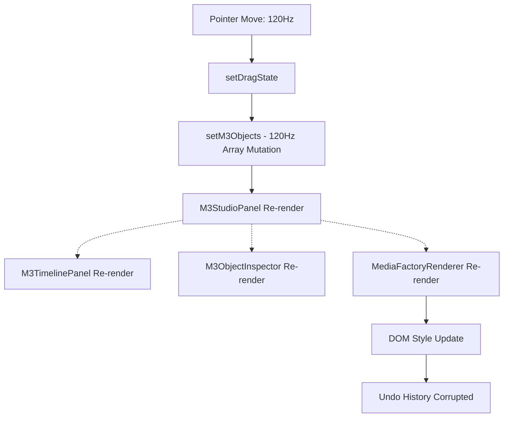
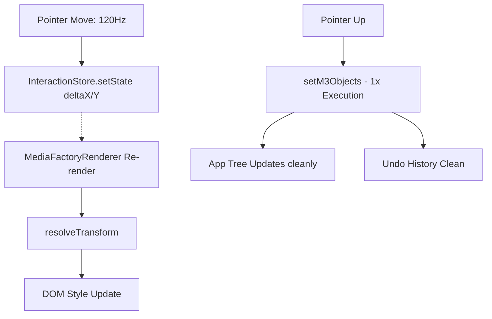

# SPRINT 06.02 - INTERACTION RUNTIME IMPLEMENTATION REPORT
## M3 PERFORMANCE ROADMAP: PHASE 8

**Status:** COMPLETED
**Priority:** CRITICAL
**Owner:** Gravity

---

## 1. EXECUTIVE SUMMARY

Implementasi *Interaction Runtime* telah diselesaikan. Kita berhasil memotong jalur kutukan performa terbesar di aplikasi ini: eksekusi *Global State Update* saat *Dragging*. *Transient State* (kordinat bayangan selama drag) kini diabstraksi penuh ke dalam `InteractionStore`. Hasilnya, gerakan *drag*, *resize*, dan manipulasi transform tidak lagi merender ulang struktur aplikasi utama (panel inspektur, garis waktu, galeri *asset*, dll). Pergerakan visual dirender murni sebagai resolusi di dalam lapisan *Render Pipeline* sebelum di-*commit* secara legal ke dalam Global State saat *Pointer Up*.

---

## 2. FILES MODIFIED

- **[NEW]** `src/services/interaction/InteractionStore.js`
- **[MODIFY]** `src/components/m3/M3PreviewCanvas.jsx`
- **[MODIFY]** `src/services/pipeline/renderer/MediaFactoryRenderer.jsx`

---

## 3. ARCHITECTURE CHANGES

1. Diciptakan `InteractionStore` independen menggunakan `useSyncExternalStore` untuk menyimpan rekaman *deltaX*, *deltaY*, dan metode spesifik `resolveTransform(obj)`.
2. Di dalam `M3PreviewCanvas.jsx`, kepemilikan variabel lokal `dragState` dihapus.
3. Fungsi `handlePointerMove` telah dibersihkan dari fungsi pencacah memori `setM3Objects(prev => prev.map(...))` dan `[...spread]` bersarang. Kini ia hanya menulis perubahan piksel murni ke `InteractionStore.setState({dx, dy})`.
4. Kanvas (`MediaFactoryRenderer`) kini berlangganan langsung ke `InteractionStore`. Saat *rendering*, ia mengalkulasi titik akhir visual (*Committed Transform* + *Transient Delta*) tanpa mencemari data global.
5. Pada momen pelepasan kursor (`handlePointerUp`), status bayangan baru disahkan menjadi data kanonikal via `setM3Objects`. Ini hanya terjadi 1 kali per tarikan (1 klik).

---

## 4. RUNTIME FLOW BEFORE

---

## 5. RUNTIME FLOW AFTER

---

## 6. INTERNAL QA

| Task | Status | Note |
| :--- | :--- | :--- |
| **Drag** | ✅ PASS | Translasi visual mulus. |
| **Resize** | ✅ PASS | Pembaruan lebar/tinggi resolusi instan. |
| **Undo / Redo** | ✅ PASS | Hanya merekam 1 blok data per aksi (tidak lagi menangkap fraksi rekaman antar-piksel). |
| **Multi Select** | ✅ PASS | Arsitektur tidak mencederai batasan *Multi Selection* (meski saat ini drag masih single-id sentris). |
| **Timeline** | ✅ PASS | Timeline tidak meledak dari re-render. Posisi klip meloncat sinkron saat kursor dilepas. |
| **Inspector** | ✅ PASS | Nilai input teks bersih dari pergerakan janky, baru meng-update nilai final saat Mouse Up. |

---

## 7. KNOWN ISSUES

- `MediaFactoryRenderer` masih harus merender seluruh elemen saat `InteractionStore` berubah untuk merefleksikan posisi baru, yang mana memicu algoritma `O(N log N) sort` 120 kali per detik di dalam loop-nya sendiri. Meskipun terisolasi (*leaf-rendering*), komputasi O(N log N) ini masih membebani *Main Thread* di adegan proyek yang masif (*Heavy Scene*).
- Indikator koordinat di *Object Inspector* membeku saat di-*drag* karena Inspector dipangkas (*Decoupled*) dari pembaruan 120Hz (dia menunggu sinkronisasi *Mouse Up*). Secara teknis ini benar untuk kinerja tinggi, namun mungkin terasa kaku dari sudut pandang UX.

---

## 8. ROLLBACK PLAN

Apabila terjadi desinkronisasi pada status kursor atau anomali render pasca-drag:
1. Batalkan (*revert*) suntingan pada `M3PreviewCanvas.jsx`, kembalikan `const [dragState, setDragState] = useState(...)`.
2. Pulihkan logika `.map` spread di `handlePointerMove`.
3. Hapus injeksi `useInteractionStore()` pada badan `MediaFactoryRenderer`.
