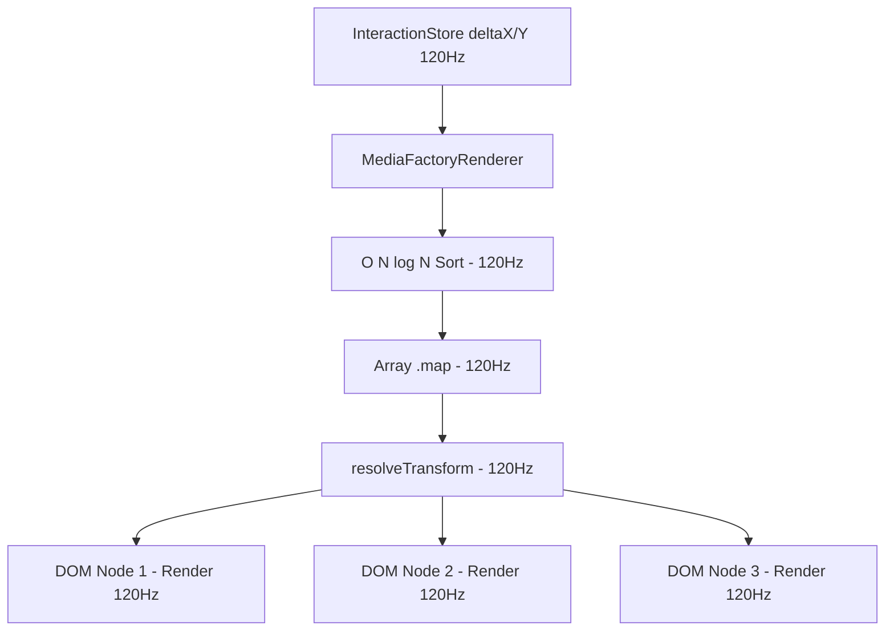
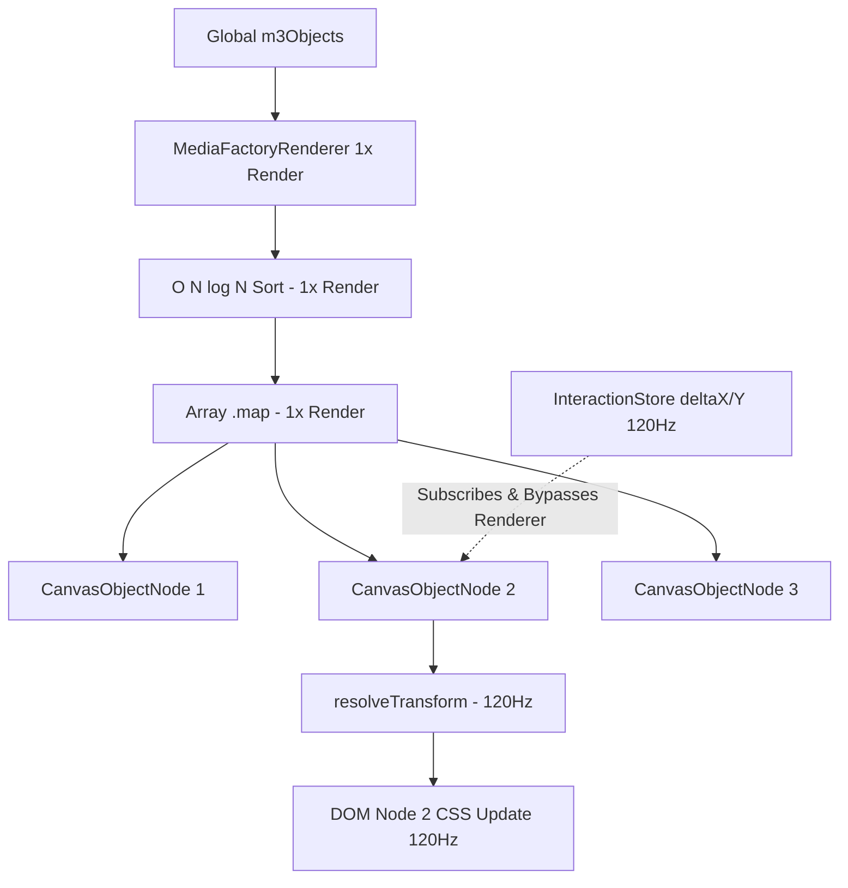

# SPRINT 06.04 - RENDERER RUNTIME PROFILING & ARCHITECTURE
## M3 PERFORMANCE ROADMAP: PHASE 8

**Status:** COMPLETED
**Priority:** CRITICAL
**Owner:** Gravity

---

## 1. EXECUTIVE SUMMARY

Sprint ini menginvestigasi arsitektur terdalam dari `MediaFactoryRenderer`. Bukti forensik dari Sprint 6.3 menyimpulkan bahwa beban prosesor kini terkonsentrasi pada rutinitas "Full Canvas Map & Sort" berfrekuensi 120Hz di dalam komponen ini. Hasil analisis membuktikan bahwa `MediaFactoryRenderer` tidak boleh mengetahui pergerakan temporer (Transient Move), melainkan hanya mengelola formasi statis (struktur jumlah/urutan elemen). Tanggung jawab terjemahan koordinat CSS (*Transform*) harus didelegasikan turun menuju tingkat Daun (*Leaf Object Node*).

---

## 2. DETERMINATION & VALIDATION

1. **Apakah Render Tree harus berubah saat object bergerak?**
   **TIDAK.** Menyeret atau memperbesar objek tidak mengubah urutan elemen di dalam kanvas (z-index) maupun komposisi pohon DOM. Struktur akar DOM (*Render Tree*) di kanvas seharusnya benar-benar membeku (*static/frozen*) saat interaksi berlangsung.

2. **Apakah Sort hanya dibutuhkan saat layer berubah?**
   **YA.** Komputasi `[...objects].sort((a,b) => a.layer - b.layer)` mutlak hanya dibutuhkan apabila: (1) Objek ditambahkan, (2) Objek dihapus, atau (3) Pengguna mengubah urutan tumpukan (*Bring Forward / Send Backward*). Saat geser (drag) murni, struktur tumpukan tetaplah konstan.

3. **Apakah Transform bisa dihitung di Leaf?**
   **BISA.** Lapisan perhitungan matriks koordinat visual, gaya skala, rotasi, dan injeksi *inline style CSS* dapat didorong murni ke dalam sebuah kelas daun (`<CanvasObjectNode>`). Daun komponen inilah yang berhak men-*subscribe* diri ke `InteractionStore`. 

4. **Apakah Map bisa tetap stabil?**
   **YA.** Menggunakan struktur `<CanvasObjectNode key={el.id} config={el} />` yang dibungkus `React.memo()`, rutinitas `.map()` tidak akan memerintahkan render berantai jika identitas *Prop* (`el`) bernilai sama.

5. **Apakah Renderer cukup menjadi static structure?**
   **YA.** `MediaFactoryRenderer` dikurangi derajat kesulitannya sekadar menjadi *Layer Manager*. Ia hanya merender bila jumlah objek berubah atau *global intro* berkedip. *Tracking* 120Hz akan ditarik paksa dari dalam dadanya.

6. **Bagaimana ObjectNode lifecycle?**
   - **Mount:** `<CanvasObjectNode>` lahir saat ID baru disisipkan ke daftar *map*.
   - **Idle:** Node tertidur tenang, melangsungkan fungsi memoized.
   - **Transient Action (Drag 120Hz):** Daun komponen ini membaca `InteractionStore`. Jika ID-nya cocok dengan yang sedang diseret, *hanya node ini yang merender ulang CSS transform-nya* (1 node daun melakukan mikro-render lokal!).
   - **Commit Action (Mouse Up):** `MediaFactoryRenderer` melempar properti data `config` yang diperbarui.
   - **Unmount:** Dihancurkan saat *delete*.

7. **Bagaimana Add/Delete Object memengaruhi Render Tree?**
   Penambahan atau penghapusan memicu pembaruan *Global State*. Pada momen langkah lambat (sekali klik) ini, barulah algoritma O(N log N) `sort()` dijalankan untuk meregenerasi kerangka DOM baru. Ini aman karena frekuensinya bukan 120 kali/detik.

---

## 3. CURRENT VS PROPOSED ARCHITECTURE

### Current Architecture

*(Seluruh objek tereksekusi tanpa terkecuali!)*

### Proposed Architecture

*(Hanya daun/node spesifik yang disentuh kursor yang bereaksi)*

---

## 4. RISK & BENEFIT

### Risk
- Memperkenalkan kerumitan pelacakan properti di lapisan Leaf Component. Sinkronisasi ganda diperlukan: Node harus mendahulukan posisi bayangan (*Transient Transform*) ketimbang posisi nyata (*Committed Data Prop*) selama `isDragging` bernilai benar untuk ID-nya.

### Benefit
- Menurunkan beban CPU eksekusi kanvas (dari $\sim$300 kalkulasi DOM yang tidak terpakai menjadi 1 kalkulasi DOM Node yang benar-benar tersentuh kursor).
- Menghapuskan sama sekali komputasi `Array.sort` di jalur panas (*hot path*).

---

## 5. MIGRATION STRATEGY

1. Membebaskan `MediaFactoryRenderer` dari kurungan langganan 120Hz (mencabut impor `useInteractionStore`).
2. Menciptakan komponen mandiri `CanvasObjectNode.jsx` yang menyimpan seluruh logika penentuan tata letak absolut (X, Y, Skala, Transform), lalu mengaitkannya dengan `useInteractionStore()`.
3. Membungkus `CanvasObjectNode` dengan `React.memo` menggunakan ekualitas rujukan properti ID.
4. Mengganti sekuens panjang pemecahan tipe objek (`if (el.type === 'subtitle') ...`) yang ada di dalam badan `map()` milik `MediaFactoryRenderer` dengan pemanggilan sederhana `<CanvasObjectNode config={el} ... />`.
