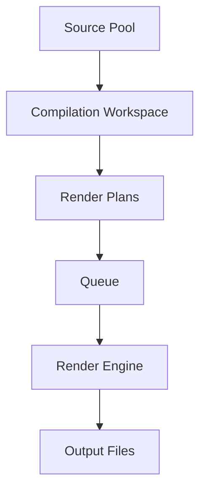

# Architecture

## Mode 2 Architecture

### Mode 2 Full Pipeline

### QueueJob schema
The Queue stores immutable snapshots of the Render Plans at the time they are queued. The QueueJob schema is enriched with fields like `outputPath`, `completedAt`, and `outputSizeMb` upon rendering completion, ensuring that subsequent changes to the workspace do not affect pending queue items.

### RenderPlan schema
The RenderPlan schema defines the exact specification for a single compilation task, including the sequence of tracks, the target output file name, and the specific audio profile parameters to apply during rendering.

### Cache flow
The system requires assets to be cached locally before rendering. The CacheManager handles the source-to-cache resolution pipeline, downloading yt-dlp sources, ensuring assets exist, and providing validated local file paths to the rendering engine.

### Cache Subsystem
A dedicated Cache Manager Subsystem provides full control over `.mediafactory/cache/m2`. It monitors file counts and size, and ensures health integrity.
- **Combined Orphan Detection**: To prevent valid cache files from being deleted after a Vite dev server restart, orphan detection builds a combined reference set from backend in-memory jobs AND explicit client-side `localStorage` keys (`mediafactory_m2_queue` and `mediafactory_m2_completed`). A cache file is only an orphan if it is absent in all sources.
- **Health Rules**:
  - `GOOD`: `orphanCount === 0` and `invalidCount === 0`.
  - `WARNING`: `orphanCount > 0` or `invalidCount > 0`.
  - `CRITICAL`: validation failure or directory access failure.
- **Last Validated Persistence**: The successful validation timestamp is persisted to `localStorage` under `mediafactory_m2_cache_last_validated` and shown in the UI.
- **Protected Concat Manifests**: Manifest files (`concat_*.txt`) are protected and never deleted if their corresponding queue IDs are still referenced by in-memory jobs or client-side queues.

### FFmpeg flow
FFmpeg is used as the core rendering backend to process cached assets and encode them into the final Output Files (MP3). The rendering engine is implemented as a Vite plugin (`vite-plugin-render-engine.js`) that spawns FFmpeg child processes, manages the execution, and reports progress back to the frontend.

### Audio Preview flow
The frontend allows real-time audio preview generation by interacting with the backend. It compiles a short snippet of tracks to let users hear transitions and audio parameters before running a full render.

### Native picker flow
Source addition supports a native picker flow using standard browser APIs (`window.showOpenFilePicker` and `window.showDirectoryPicker`), with robust backend fallbacks leveraging PowerShell `-sta` dialogs. This ensures users never have to manually type system paths.

### Multi-output workflow
The workflow supports generating multiple MP3 outputs from a single compilation workspace by configuring the output count.

### LocalStorage persistence locations
The application state is persisted in the browser's LocalStorage to maintain user data across sessions. Data includes source pool items, active compilation workspace state, global audio profile settings, and the scheduler settings (`mediafactory_m2_scheduler`).

### Scheduler Subsystem
A frontend-only scheduling system (`SchedulerService.js` and `SchedulerPanel.jsx`) enables automated playlist compilation and rendering:
- **Interval and Daily triggers**: Supports exact interval intervals (1h, 3h, 6h, 12h, 24h) and daily specific execution time (HH:mm).
- **Full Automation Pipeline**: Triggers the compilation/shuffle engine, generates render plans, adds them directly to the rendering queue, and activates the render runner.
- **Safety Locks**: Includes a *Queue Busy Lock* (skips tick if queue contains `PENDING` or `RENDERING` jobs) and an *Anti-Spam Execution Lock* (`isRunning` state) to prevent overlapping ticks.
- **Local Persistence & Error Tolerance**: Saves state entirely in browser `localStorage` and logs failures to the activity log without disabling the schedule ticker.
- **Verification Status**: Fully implemented programmatically; awaiting final runtime verification with live UI screenshot evidence.

### History Subsystem
A dedicated pure service (`RenderHistoryService.js`) maintains an immutable record of all completed and failed render jobs. 
- **Storage**: `mediafactory_m2_render_history` in `localStorage`, capped strictly at 500 entries.
- **Purity**: The service is entirely pure; logging side effects (`[M2 Analytics] History Added/Cleared/Corrupted`) are explicitly managed by `App.jsx`.
- **UI Performance**: `RenderAnalyticsPanel.jsx` derives statistics via `getStats()` from the service to enforce a single source of truth, and renders only the latest 50 entries to prevent DOM bloat.
- **Immutability**: History entries are immutable snapshots of the final execution state and track exact FFmpeg filter strings (`masteringChain`) and engine versions (`renderEngineVersion`).

### Production Template System
A standalone configuration saver (`ProductionTemplateEntity.js` and `TemplateManagerService.js`) that allows users to persist entire workspace settings as loadable templates.
- **Storage**: `mediafactory_m2_templates` in `localStorage`, capped strictly at 100 entries. Instead of auto-pruning, it returns `TEMPLATE_LIMIT_REACHED` when full.
- **Data Isolation**: Templates safely extract `compilationSettings`, `masteringSettings`, `audioProfile`, `namingPattern`, and `schedulerSettings`. They explicitly **exclude** active runtime states like Queue, Render History, Cache, and Output Files.
- **Security**: Fixed sources templates are stripped of absolute filesystem paths (`localPath`) and only store `sourceId`, `title`, `sourceType`, and `youtubeUrl`.

### Export / Import Subsystem
A robust data transfer architecture (`ExportImportService.js` and `DataTransferPanel.jsx`) that allows migrating full application configurations between machines safely.
- **Rule of No Execution**: Import routines strictly update UI state boundaries without triggering `startLoop()`, FFmpeg encoding, or Scheduler ticks. Batches and Schedules are forced into `PAUSED`/`IDLE` respectively.
- **Strict Data Segregation**: Configuration states (workspace, templates, scheduler) are exportable, whereas volatile runtime states (`mediafactory_m2_queue`, cache manifests, pending jobs) are explicitly excluded to prevent runtime disruption.
- **Snapshot Recovery**: Prior to any overwrite execution, a complete state image is backed up to `mediafactory_m2_backup_pre_import`. Corrupt or failed JSON hydration events seamlessly restore the pre-import snapshot.
- **Hot-Swapping**: The application performs hot hydration through standard event channels (`IMPORT_COMPLETED`), bypassing disruptive page reloads entirely.