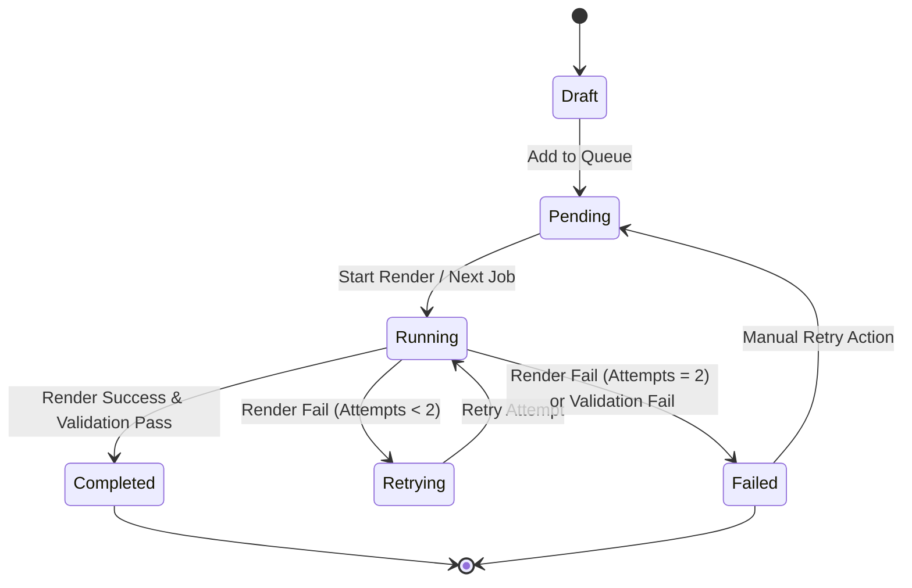

# Queue Specification: MediaFactory

This document details the Queue Engine lifecycle, states, and forecasting calculations for MediaFactory.

---

## Queue States

* **Draft**: A job configuration currently being composed in the workspace. It has not been submitted to the runner queue.
* **Pending**: The job is queued and waiting for its turn to execute.
* **Running**: The job's FFmpeg/rendering command is actively executing.
* **Retrying**: The job failed a run, and the Retry Engine is waiting or running a subsequent retry.
* **Completed**: The job has successfully rendered, passed Validation, and successfully triggered post-processing (such as AutoUploader).
* **Failed**: The job failed rendering or validation after all retry attempts were exhausted.

---

## Queue Lifecycle & State Transitions

### State Transition Rules
- **Draft → Pending**: Initiated by user clicking **Add to Queue**.
- **Pending → Running**: Evaluated when the execution head advances.
- **Running → Retrying**: Triggered on render process failure if active retry attempts are less than 2.
- **Running → Completed**: Occurs only after both the Render Engine completes successfully and the Validation Engine confirms file integrity.
- **Running/Retrying → Failed**: Occurs if the render fails on the 3rd attempt (original + 2 retries) or if post-render validation fails.

---

## Queue Modification Behaviors

- **Queue Editing**: Users can edit parameters of jobs in the **Pending** or **Draft** state. Jobs in **Running**, **Completed**, or **Failed** states cannot be edited.
- **Queue Deletion**: Jobs in **Pending**, **Failed**, or **Draft** states can be deleted. If a job is currently **Running**, the delete action behaves as a cancel/kill request, terminating the active FFmpeg child process before removing the entry.
- **Queue Duplication**: Users can duplicate any job in the queue (regardless of its current state) to clone its parameter set back into a **Pending** or **Draft** state.

---

## Error Handling & Reliability Rules

- **Queue Isolation**: The Queue must never pause, halt, or stop processing because of a failed task.
- **Fail Over Processing**: A failed task is immediately moved to the **Failed Queue** history, and the Queue Engine automatically pulls the next **Pending** task.
- **Auto-Retry Limit**: Set strictly to 2 retry attempts.
- **Morning Report Summary**: When rendering queues run unattended (e.g., overnight), the Notification Center records final states to compile a Morning Report.

---

## Queue Forecasting Concepts

The Queue Engine performs execution and resource calculations before and during runs:

### 1. Estimated Time (ET)
* Calculated by summing the durations of all input audio playlists in the pending queue multiplied by a render speed multiplier.
* **Formula**: `ET = Sum(Audio Playlist Durations) * Render Speed Factor` (where factor is determined by mode and default quality).

### 2. Estimated Storage (ES)
* Prior to processing, the Storage Estimation Engine predicts the required disk footprint.
* **Formula**: `ES = Sum(Expected Output Resolution Bitrate * Target Audio Duration)`
* If `ES > Available Local Disk Space`, the UI disables queue additions and displays warning alerts.

### 3. Expected Completion Time (ECT)
* Calculated by adding the current system time to the cumulative Estimated Time of all pending jobs.
* **Formula**: `ECT = Current Time + Remaining ET`
