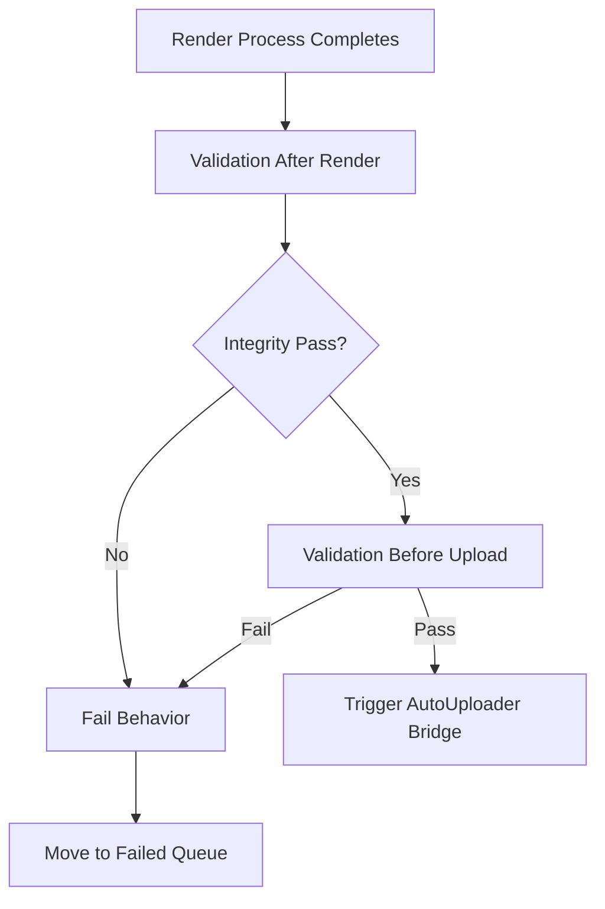

# Validation Specification: MediaFactory

This document details the checks performed by the Validation Engine for each Mode in MediaFactory, as well as post-processing and error routes.

---

## Mode-Specific Validation Criteria

### Mode 1 Validation
Before a job is marked complete, the Validation Engine checks:
- **Video Exists**: The compiled output video file must exist at the defined output folder path.
- **Audio Exists**: The target audio track components must exist and remain accessible.
- **Duration Valid**: Output video duration must match the duration of the assigned audio track (verifies successful looping).
- **Render Complete**: Confirm the FFmpeg process returned a `0` exit code.

### Mode 2 Validation
For randomized playlist audio files:
- **Audio Exists**: The generated MP3 file must exist in the output directory.
- **Duration Valid**: Output compilation file length must approximate the 15-minute target duration configuration.
- **Silence Detection**: Run silence checks to identify audio dropouts or encoding errors.
- **File Health Check**: Confirm output file structure is playable and not corrupted (e.g. metadata tags are valid).

### Mode 3 Validation
For playlist videos:
- **Background Exists**: Ensure the source image or video background file path is valid.
- **Audio Exists**: Ensure all playlist audio track source assets exist.
- **Playlist Generated**: Confirm the playlist audio sequence completed successfully.
- **Thumbnail Generated**: Confirm a companion thumbnail image (JPG/PNG) was successfully written.
- **Timestamp Generated**: Confirm a companion timestamp log file (TXT) was successfully written.
- **Render Complete**: Validate that the final rendering process exited cleanly with standard formats.

---

## Validation Workflow

### Validation After Render (Post-Render Check)
Immediately following FFmpeg process completion:
1. Verify target output file sizes are greater than zero.
2. Read video streams using `ffprobe` to ensure no stream corruption.
3. For Mode 3, confirm the companion assets (thumbnail, timestamps) are generated in the folder.

### Validation Before Uploader
Before calling the AutoUploader Bridge:
1. Verify channel credential variables are active.
2. Double check file stream locks are released by the operating system.
3. Ensure file output formats match target channel constraints.

---

## Outcome Behaviors

### Pass Behavior
* If all validation criteria pass:
  * Set task state to `Completed`.
  * Trigger upload actions (if Mode has AutoUploader enabled and configuration profile is present).

### Fail Behavior
* If any validation check fails:
  * Halt further automatic execution for this job.
  * Inform the Retry Engine to initiate retry routines (if retry attempts remain).

### Failed Queue Behavior
* If validation fails after all retry attempts are exhausted:
  * Mark job state as `Failed`.
  * Write the specific validation error message (e.g., `Validation Failure: Duration mismatch`) to the queue database entry.
  * Proceed to run the next item in the Queue.
